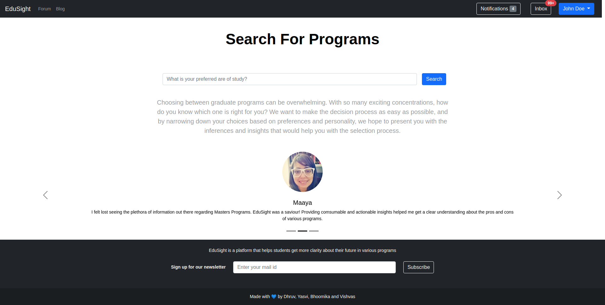
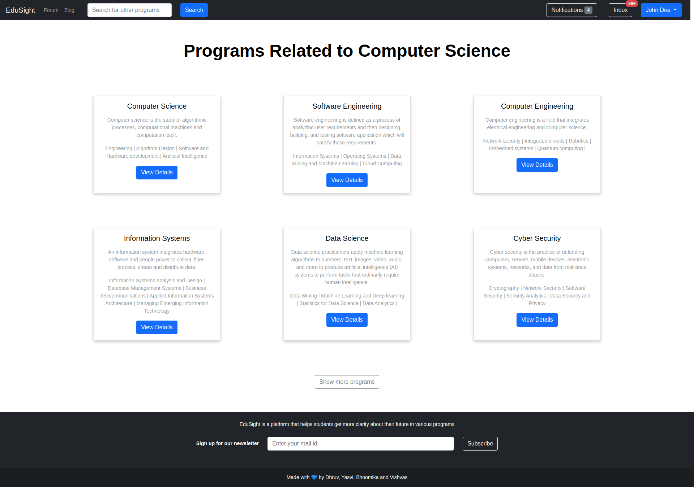
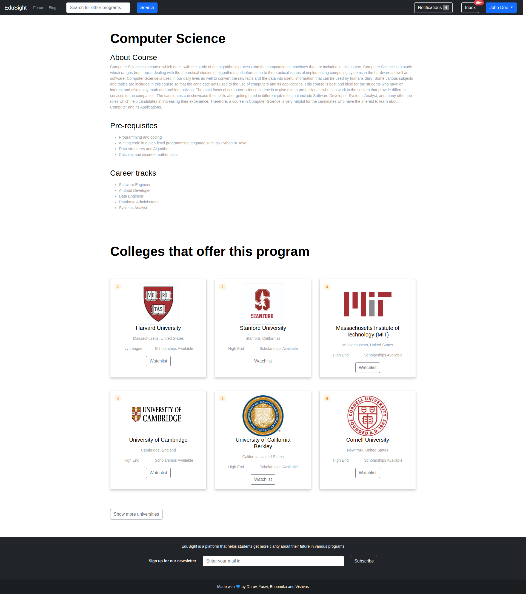
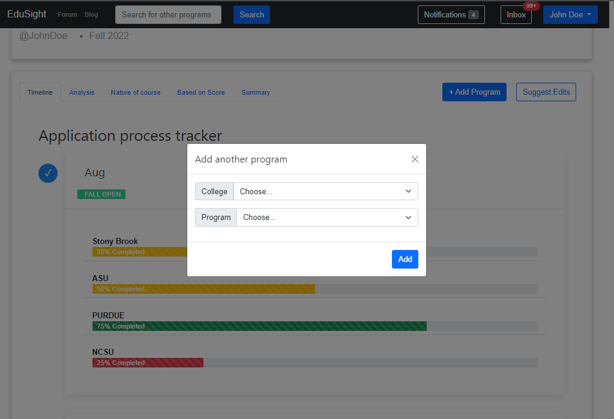
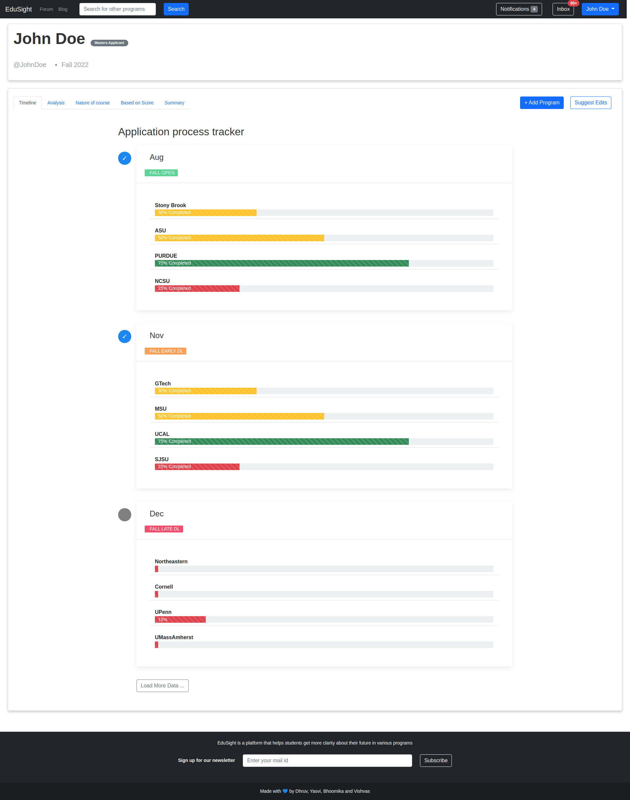
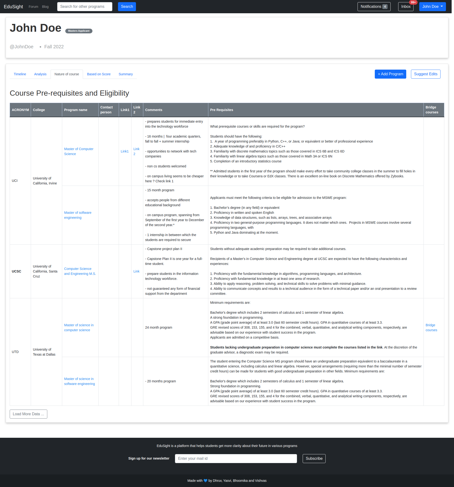
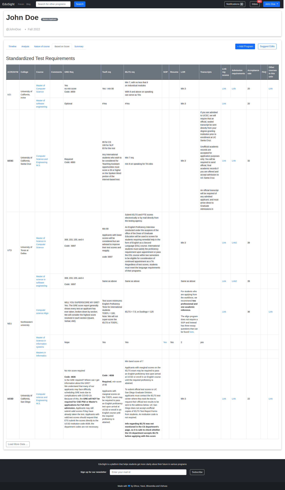
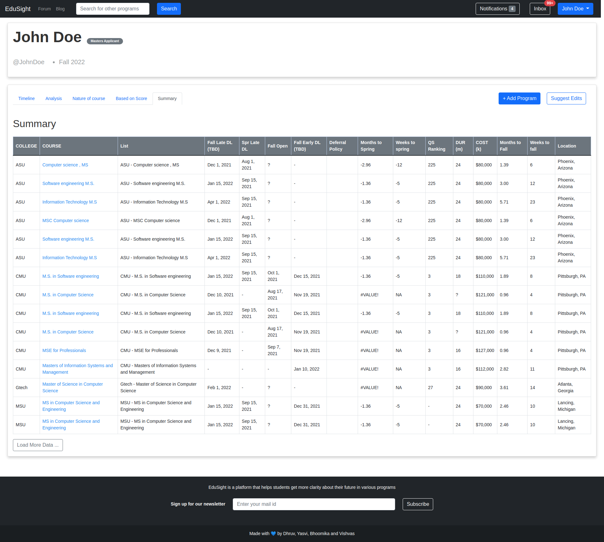

## Landing Page

    

 

## List Of Programs Page

    

## Program Information Page

    

## Discussion Forum Section

    

 

## Add Or Edit Program Section

    

 

## User Profile App ln Time Line Tracker

    

## Program Analysis Page

    

## Detailed Information on Course Prerequisites Page

    

 

## Detailed Information on Program Score Required Page

    

## Consolidated Summary of Programs Page

    

 